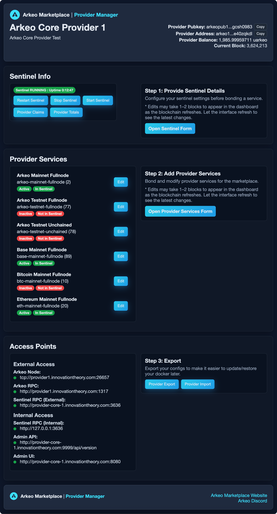
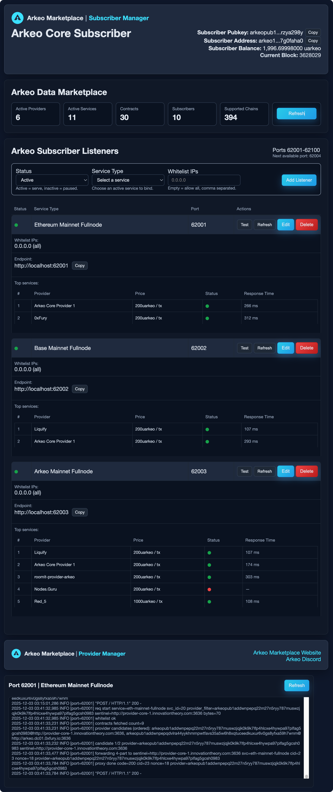

# Arkeo Data Marketplace - Management System
Here are some docker container images that make it easy to participate in the Arkeo Data Marketplace, either by serving blockchain node data as a provider or consuming it as a subscriber.

## Arkeo Provider Admin (Docker Image)
Run an admin UI to connect your blockchain data nodes to the Arkeo Data Marketplace and earn Arkeo tokens for the data you provide with a blockchain-based pay-as-you-go model.

Read the full guide: [provider-core/README.md](provider-core/README.md).

## Arkeo Subscriber Admin (Docker Image)
Run an admin UI to create subscriber proxies for the Arkeo Data Marketplace that automatically handle pay-as-you-go blockchain contracts with top providers.

Read the full guide: [subscriber-core/README.md](subscriber-core/README.md).
